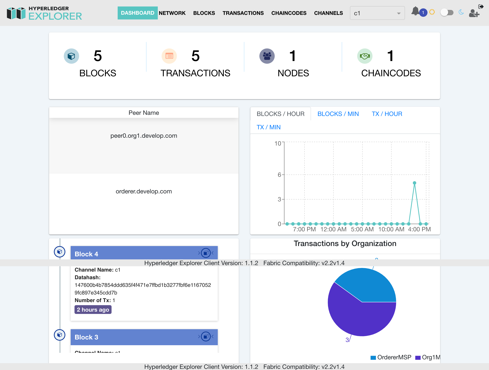

Hyperledger Explorer是Fabric的管理后台。通过Explorer，可以很直观地看到Fabric网络的区块信息，网络状态。

以下是[devnet](https://github.com/stephenwu2020/fabric-cases/tree/master/devnet)的运行情况:



## 运行
1. 拉取[fabric-cases](https://github.com/stephenwu2020/fabric-cases)
2. 启动devnet
   ```
   cd devnet
   ./builder.sh new
   ```

3. 启动explorer
  ```
  cd explorer
  make up
  ```

## 配置
Explorer的配置文件在:./connection-profile/devnet.json